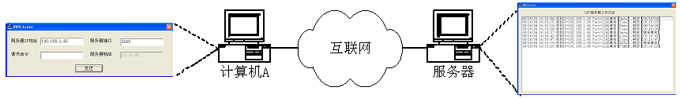
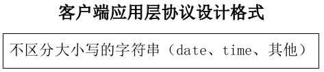
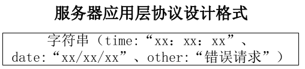
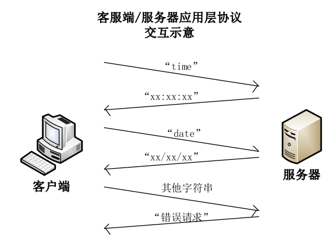
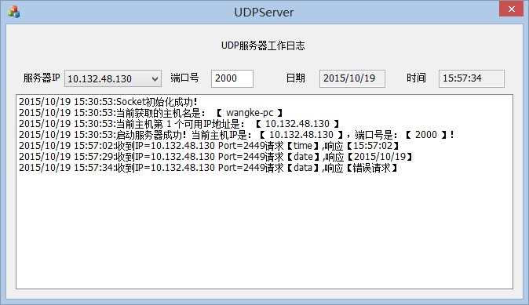
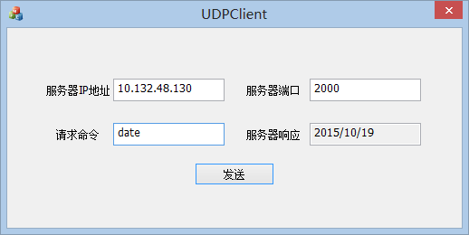
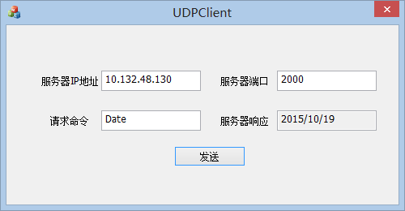
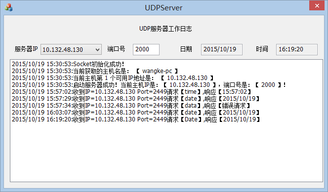
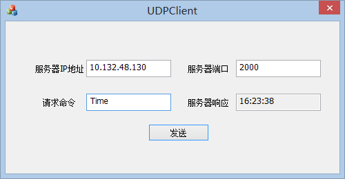
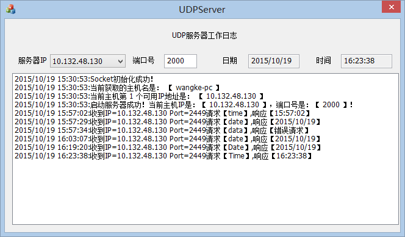

# 简单的客户/服务器程序

## 一、 实验要求介绍

本实验要求利用 CAsyncSocket 类编写一个简单的客户/服务器程序,客户/服务器之间使用数据报方式传递信息,服务器在收到客户发来的 Time 或Date 请求后,利用本地的时间日期分别进行响应,如下图所示。通过该编程
实验,可以加深对客户/服务器交互模型的理解,学习简单的 socket 编程方法。

## 二、 实验编译运行环境 

本程序编译环境是：Visual Studio 2012；系统环境是：Windows 8（64位）；

## 三、 编写“简单的路由器”软件运行效果

本客户端/服务器应用层协议分成两部分:
- 客户端:
	

	
客户端可以发出不分大小写的字符串命令:
当是“date”或“time”时,会收到来自服务器正确的 date 或 time 格式回复命令,当是其他字符串时,收到“错误请求”回复命令。

- 服务器:

当收到请求是不区分大小写的 date 字符串时,返回本机日期:
格式是“xx/xx/xx”。

当收到请求是不区分大小写的 time 字符串时,返回本机时间:
格式是“xx:xx:xx”。

当收到请求是其他字符串时,返回“错误请求”字符串。

- 客户端、服务器交换协议示意图:

## 四、实验实现功能介绍

1. 服务器端效果显示:

服务器“UDPServer.exe”打开后显示界面如下:

2. 客户端效果显示:

客户端“UDPClient.exe”打开后显示界面如下:

3. 客户/服务器交互效果显示:

	1. 客户端发送正确的 date 指令,服务器显示客户端连接日志,然后响应客户端并在客户端上显示响应日期内容:
		- 客户端：

		

		- 服务器端:

		

	2. 客户端发送正确的 time 指令,服务器显示客户端连接日志,然后响应客户端并在客户端上显示响应时间内容:
		- 客户端：

		

		- 服务器端:

		

## 五、其他

实验原理和程序实现步骤及代码见代码和文档

